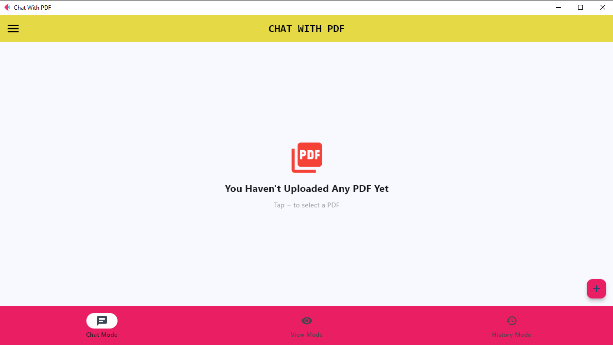

# 📄 Chat With PDF — AI-Powered PDF Retrieval Application

**Chat With PDF** is a lightweight AI-powered document retrieval application that allows users to upload a PDF and search its content using natural-language queries.

The application extracts text from PDF documents, divides the content into smaller chunks, generates vector embeddings, stores them in an in-memory **ChromaDB** vector database, and retrieves the most relevant sections based on the user's query.

Built with **Python, Flet, PyMuPDF, pypdf, LangChain Text Splitters, and ChromaDB**.



## ✨ Features

* 📂 Upload and process PDF documents
* 🔍 Semantic search over PDF content
* 🤖 Natural-language querying
* 📑 Display relevant document sections
* 📌 Show page numbers for retrieved content
* 🧠 Vector-based document retrieval
* 🗃️ ChromaDB-based vector storage
* 🔄 PyMuPDF with pypdf fallback for PDF extraction
* ✂️ Intelligent text chunking using LangChain
* 📚 Search history
* 📊 Display vector distance for retrieved results
* ⚡ Responsive progress indicators during PDF processing
* 🖥️ Cross-platform UI using Flet

## 🏗️ System Architecture

The application follows the following document retrieval pipeline:

```text
              ┌─────────────────┐
              │   PDF Upload    │
              └────────┬────────┘
                       │
                       ▼
             ┌───────────────────┐
             │  PDF Text         │
             │  Extraction       │
             │  PyMuPDF          │
             └─────────┬─────────┘
                       │
                  If required
                       │
                       ▼
             ┌───────────────────┐
             │      pypdf        │
             │   Fallback Loader │
             └─────────┬─────────┘
                       │
                       ▼
             ┌───────────────────┐
             │ Text Cleaning     │
             └─────────┬─────────┘
                       │
                       ▼
             ┌───────────────────┐
             │ Text Chunking     │
             │ LangChain         │
             │ Splitter          │
             └─────────┬─────────┘
                       │
                       ▼
             ┌───────────────────┐
             │ Vector Embeddings │
             └─────────┬─────────┘
                       │
                       ▼
             ┌───────────────────┐
             │     ChromaDB      │
             │ Vector Database   │
             └─────────┬─────────┘
                       │
                       │
       ┌───────────────┘
       │
       ▼
┌──────────────────────┐
│ User Query           │
└──────────┬───────────┘
           │
           ▼
┌──────────────────────┐
│ Query Embedding      │
└──────────┬───────────┘
           │
           ▼
┌──────────────────────┐
│ Similarity Search    │
│ Top 5 Results        │
└──────────┬───────────┘
           │
           ▼
┌──────────────────────┐
│ Relevant PDF Content │
│ + Page Information   │
└──────────────────────┘
```

## 🔄 How It Works

### 1. Upload PDF

The user selects a PDF using the Flet file picker.

The selected file is temporarily stored on the system before processing.

### 2. Extract PDF Text

The application first attempts to extract text using **PyMuPDF**.

If usable text cannot be extracted, **pypdf** is used as a fallback.

### 3. Clean the Text

Extracted text is cleaned by removing unnecessary whitespace, line breaks, and empty content.

### 4. Split the Document

The cleaned text is divided into smaller chunks using:

```text
Chunk Size   : 800
Chunk Overlap: 120
```

Each chunk retains metadata such as:

* Page number
* Source PDF filename

### 5. Generate Embeddings

ChromaDB's default embedding function converts document chunks into vector representations.

### 6. Store in ChromaDB

The generated vectors and their associated metadata are stored in an **Ephemeral ChromaDB collection**.

This means the vector database exists during the application's runtime rather than being persisted as a permanent database.

### 7. Ask a Question

The user enters a natural-language query such as:

```text
What are the main topics discussed in this document?
```

### 8. Semantic Retrieval

The query is converted into a vector representation and compared against the stored document vectors.

The application retrieves up to **five relevant document chunks**.

### 9. Display Results

The retrieved content is displayed with:

* Relevant document number
* Page number
* Extracted text
* Vector distance

### 10. Search History

Previous queries and their retrieved results are maintained during the current application session and displayed through **History Mode**.

## 🛠️ Technologies Used

| Technology                   | Purpose                                |
| ---------------------------- | -------------------------------------- |
| **Python**                   | Core programming language              |
| **Flet**                     | Graphical user interface               |
| **PyMuPDF**                  | Primary PDF text extraction            |
| **pypdf**                    | PDF extraction fallback                |
| **LangChain Text Splitters** | Document chunking                      |
| **ChromaDB**                 | Vector database and semantic retrieval |
| **Regular Expressions**      | Text cleaning                          |

## 📁 Project Structure

```text
Chatbot/
│
├── chatbot.py
├── requirements.txt
│
├── assets/
│   ├── icon.jpg
│   ├── android_icon.jpg
│   └── project_architecture.jpg
│
└── README.md
```

### Main Files

**`chatbot.py`**

Contains the complete application logic including:

* PDF loading
* Text extraction
* Text cleaning
* Text splitting
* ChromaDB integration
* Semantic search
* Flet user interface
* Search history
* Result visualization

**`requirements.txt`**

Contains the Python dependencies required to run the application.

## 🚀 Installation

### 1. Clone the Repository

```bash
git clone https://github.com/YOUR_USERNAME/ai-pdf-chatbot.git
```

### 2. Navigate to the Project

```bash
cd ai-pdf-chatbot/Chatbot
```

### 3. Create a Virtual Environment

```bash
python -m venv venv
```

### 4. Activate the Virtual Environment

### Windows

```bash
venv\Scripts\activate
```

### Linux / macOS

```bash
source venv/bin/activate
```

### 5. Install Dependencies

```bash
pip install -r requirements.txt
```

## ▶️ Run the Application

Run the following command:

```bash
python chatbot.py
```

The Flet application will start and display the **Chat With PDF** interface.

## 💬 Example Usage

### Step 1 — Upload a PDF

Click the **+** button and select a PDF document.

### Step 2 — Wait for Processing

The application will:

```text
Upload PDF
    ↓
Extract Text
    ↓
Clean Text
    ↓
Split Into Chunks
    ↓
Generate Embeddings
    ↓
Store in ChromaDB
```

### Step 3 — Ask a Question

For example:

```text
What is the main purpose of this document?
```

or:

```text
Explain the important topics discussed in the PDF.
```

or:

```text
What are the key concepts mentioned on page 5?
```

### Step 4 — View Results

The application returns the most relevant document sections along with their page numbers.

## 🖥️ Application Modes

### 💬 Chat Mode

Allows users to enter questions and retrieve relevant PDF content.

### 👁️ View Mode

Displays information about the application and its architecture.

### 🕘 History Mode

Displays previous queries and their retrieved document sections during the current session.

## ⚙️ Current Retrieval Configuration

The application currently uses:

```text
Chunk Size       : 800 characters
Chunk Overlap    : 120 characters
Retrieved Results: Up to 5
Batch Size       : 32 chunks
Vector Database  : ChromaDB
Database Type    : Ephemeral
```

These parameters can be modified in `chatbot.py` depending on the document type and retrieval requirements.

## 📌 Use Cases

The application can be useful for:

* 📖 Academic study materials
* 📑 Research papers
* 📚 Books and notes
* 🏫 Educational documents
* 🏢 Business reports
* 📋 Technical documentation
* 📄 Project reports
* 📊 Manuals and guidelines

## ⚠️ Limitations

* The current system primarily works with text-based PDFs.
* Scanned or image-only PDFs require OCR.
* ChromaDB uses an in-memory database, so indexed documents are not permanently stored between application sessions.
* The application retrieves relevant document sections rather than generating a synthesized natural-language answer.
* Search history is maintained only during the current application session.
* Very large PDF documents may require additional memory and processing time.

## 🔮 Future Enhancements

The project can be extended with the following features:

* 🧠 Large Language Model (LLM) based answer generation
* 🔗 Retrieval-Augmented Generation (RAG)
* 👁️ OCR support for scanned PDFs
* 💾 Persistent ChromaDB storage
* 📚 Support for multiple PDFs
* 📊 Retrieval evaluation metrics
* 🎯 Improved semantic ranking
* 📝 Automatic document summarization
* 💡 Question generation from documents
* 🌐 Web-based deployment
* 🔐 User authentication
* 📈 Analytics dashboard
* 🗣️ Voice-based PDF interaction
* 🌍 Multilingual PDF question answering
* ⚡ GPU acceleration for large-scale document processing
